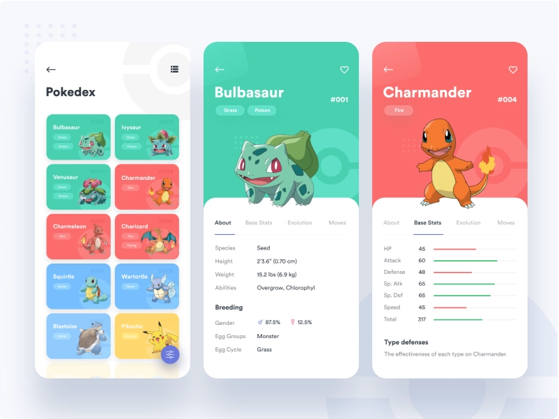

# Pokedex
Objetivo deste projeto é criar uma Pokedex totalmente responsiva, com paginação, filtro por tipo de pokemon, conectada à [Poke API](https://pokeapi.co/) e com boas práticas para reduzir a verbosidade do código, consolidando meus estudos com API's RESTful

# Design Preview

Vou utilizar o design que está no site [Dribbble](https://dribbble.com/shots/6540871-Pokedex-App) como inspiração na criação da minha pokedex

<h1 align="center">
   
  
   
</h1>

# Funcionalidades

<h2 align="center"> 
   
  Primeira fase do projeto
</h2>

- [x] Estilização da página de listagem
  - [x] Estilização inicial
  - [x] Estilização da listagem de Pokémon
  - [x] Adicionando a imagem do Pokémon
  - [x] Adicionando os tipos dos Pokémon e finalizando layout da imagem
  - [x] Melhorando estilização dos pokemon do tipo fogo
  - [x] Tornando layout responsivo
  - [x] Separando e organizando os estilos

- [ ] Integrando com a Poke API
  - [x] Fazer requisição para pegar lista de pokémon
  - [x] Transformando a lista da API (JSON) em HTML
  - [x] Pegar nome do Pokemon e listar dinamicamente
  - [x] Separar consumo da API da manipulação de HTML
  - [x] Refatorando código com melhores práticas
  - [ ] Fazer requisição para pegar os detalhes dos pokémon
  - [ ] Converter o modelo JSON da PokeAPi para o que será usado na aplicação
  - [ ] Adicionando tipos dinamicamente
  - [ ] Adicinando botão de paginação
  - [ ] Criando mecanismo de paginação
  - [ ] Criando mecanismo para limitar a listagem na primeira geração de pokémon
  - [ ] Finalizando a listagem de pokémon

  ---
<h1 align="center">
    
  Segunda fase do projeto
   
</h1>

- [ ] Adicionando botão de filtro
- [ ] Finalizando layout do botão

